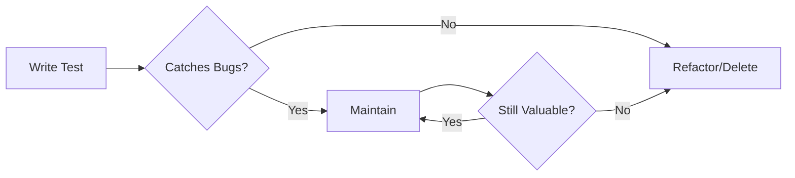

# Test Evaluation Guide

> Guidelines for evaluating test quality in Project Kairos to ensure tests verify actual functionality and prevent bugs rather than merely passing.

---

## 🚨 CRITICAL: Write Tests to Find Bugs, Not to Pass 🚨

**The #1 Rule of Testing**: Tests must be written to verify that the application works correctly for users, NOT to make test suites green.

### ✅ Correct Approach:

1. Write tests for what the feature SHOULD do
2. If tests fail, FIX THE CODE, not the tests
3. Tests should fail when functionality is broken
4. Every test should prevent a real bug

### ❌ Wrong Approach:

- Writing tests that match current (broken) behavior
- Adjusting assertions to make tests pass
- Skipping tests that reveal bugs
- Writing tests that always pass regardless of functionality

**Example from ContentEditableContainer**:

```typescript
// ❌ BAD: Test written to pass
expect(content === 'Replace that text' || content === 'Replace this textthat').toBe(true)

// ✅ GOOD: Test verifies correct behavior
expect(content).toBe('Replace that text')
// This test revealed a real bug where selection wasn't deleted before paste
```

When tests fail, ask: "Is the test wrong, or is the code wrong?" Usually, it's the code.

---

## Core Testing Philosophy

Tests should verify that the application **behaves correctly from a user's perspective**, not just that the implementation matches expectations. Every test should prevent a real bug that could affect users.

---

## Test Quality Evaluation Criteria

### 1. ✅ Tests User-Visible Behavior

**Good Test Characteristics:**

- Tests what users actually see/experience
- Verifies outcomes, not implementation details
- Would fail if the feature broke for users
- Uses semantic queries (role, text, label) over CSS/implementation

**Red Flags:**

- Tests internal state or private methods
- Checks CSS classes or DOM structure details
- Tests implementation rather than behavior
- Would pass even if feature is broken for users

### 2. ✅ Prevents Real Bugs

**Good Test Characteristics:**

- Each test prevents a specific bug scenario
- Tests edge cases users might encounter
- Verifies error handling and recovery
- Tests integration between components

**Red Flags:**

- Tests trivial things (e.g., "component renders")
- Missing critical user paths
- No error scenario testing
- Tests that never actually fail

### 3. ✅ Maintainable and Clear

**Good Test Characteristics:**

- Test name clearly describes the scenario
- Setup is minimal and focused
- Assertions are specific and meaningful
- Would be easy to fix if it breaks

**Red Flags:**

- Overly complex setup or mocking
- Unclear what's being tested
- Multiple unrelated assertions
- Brittle tests that break with minor refactors

### 4. ✅ Complete Coverage

**Good Test Characteristics:**

- Tests happy path + error cases
- Tests accessibility requirements
- Tests async behavior properly
- Tests keyboard and mouse interactions

**Red Flags:**

- Only tests happy path
- Missing error scenarios
- No accessibility testing
- Ignores async complexities

---

## Test Anti-Patterns to Avoid

### 1. Testing Implementation Details

```typescript
// ❌ Bad: Tests how it works
expect(component.state.isOpen).toBe(true)
expect(wrapper.find('.modal--open')).toHaveLength(1)

// ✅ Good: Tests what users see
expect(screen.getByRole('dialog')).toBeInTheDocument()
expect(screen.getByText('Modal Content')).toBeVisible()
```

### 2. Snapshot Testing Overuse

```typescript
// ❌ Bad: Snapshots that just pass
expect(component).toMatchSnapshot()

// ✅ Good: Specific behavior assertions
expect(screen.getByRole('button')).toHaveAttribute('aria-pressed', 'true')
expect(screen.getByText('Selected: 3 items')).toBeInTheDocument()
```

### 3. Testing Framework Instead of App

```typescript
// ❌ Bad: Tests React, not your app
const setState = jest.fn()
React.useState = jest.fn(() => [false, setState])

// ✅ Good: Tests actual behavior
fireEvent.click(screen.getByRole('button'))
expect(screen.getByRole('menu')).toBeVisible()
```

### 4. Over-Mocking

```typescript
// ❌ Bad: Mocks everything
jest.mock('./utils/everything')
jest.mock('./components/all')

// ✅ Good: Minimal mocking
// Only mock external APIs or complex dependencies
jest.mock('./api/client')
```

---

## Evaluation Process

### For Each Test File:

1. **First Question: Do These Tests Verify Real Functionality?**

   - Are tests written to verify correct behavior, or just to pass?
   - If tests are failing, should we fix the code or the tests?
   - Would these tests catch actual bugs users would experience?

2. **Read Test Names First**

   - Do they describe user scenarios?
   - Can you understand what feature is tested?

3. **Check Test Structure**

   - Are the four categories present? (Core, Interactions, Errors, A11y)
   - Is there logical grouping?

4. **Evaluate Individual Tests**

   - What bug would this test catch?
   - Would this fail if users couldn't use the feature?
   - Is it testing behavior or implementation?
   - **Critical**: Is the test asserting what SHOULD happen, not what DOES happen?

5. **Check Coverage**

   - Are error cases tested?
   - Is keyboard navigation tested?
   - Are edge cases covered?
   - Are failing tests being addressed by fixing code, not tests?

6. **Review Assertions**
   - Are they testing user-visible outcomes?
   - Are they specific and meaningful?
   - Would they catch real bugs?
   - Are assertions checking for correct behavior, not current behavior?

---

## Quality Scoring Rubric

Rate each test file on these dimensions (1-5 scale):

### Test Distribution (1-5)

- 5: Follows 70/20/10 pyramid (mostly unit tests)
- 3: Reasonable distribution but heavy on integration
- 1: Inverted pyramid (mostly E2E tests)

### Behavior Focus (1-5)

- 5: All tests verify user-visible behavior
- 3: Mix of behavior and implementation tests
- 1: Mostly implementation detail tests

### Bug Prevention (1-5)

- 5: Each test prevents a specific, real bug
- 3: Some tests are meaningful, others trivial
- 1: Tests that would pass even with broken features

### Coverage Completeness (1-5)

- 5: Happy path + errors + edge cases + a11y
- 3: Happy path + some error cases
- 1: Only happy path or trivial tests

### Maintainability (1-5)

- 5: Clear, focused, easy to understand/fix
- 3: Mostly clear with some complex areas
- 1: Overly complex, brittle, unclear

### Overall Quality

- 21-25: Excellent - Truly tests functionality
- 17-20: Good - Mostly effective with minor issues
- 13-16: Fair - Needs improvement in key areas
- 9-12: Poor - Tests for the sake of testing
- 5-8: Critical - Fundamental issues with approach

---

## Common Issues in Project Kairos Tests

Based on current patterns, watch for:

1. **Tests written just to pass** - The most critical issue
2. **Over-testing React mechanics** instead of user features
3. **Missing integration tests** between components
4. **Incomplete async testing** (loading states, errors)
5. **Limited accessibility verification**
6. **Mock overuse** that hides real issues
7. **Accepting multiple outcomes** to make tests pass (e.g., `expect(A || B).toBe(true)`)
8. **Skipping tests that reveal bugs** instead of fixing the bugs

---

## Recommendations for Improvement

### Quick Wins

- Add aria-label and role assertions
- Test error states for all async operations
- Add keyboard navigation tests
- Remove snapshot tests without clear purpose

### Medium-Term

- Write integration tests for complex flows
- Add visual regression tests for UI
- Test performance-sensitive operations
- Add E2E tests for critical paths

### Long-Term

- Establish test quality metrics
- Regular test review sessions
- Document test patterns and examples
- Create custom testing utilities

---

## Test Effectiveness Metrics

### Tracking Test Quality Over Time

#### Bug Detection Rate

```
Bug Detection Rate = (Bugs caught by tests / Total bugs found) × 100
```

Target: > 80% of bugs should be caught by automated tests

#### Test Stability Score

```
Test Stability = (Consistent passes / Total runs) × 100
```

Target: > 95% (flaky tests indicate poor quality)

#### Time to Feedback

- Unit tests: < 1 minute for full suite
- Integration tests: < 5 minutes
- E2E tests: < 15 minutes
- Total CI pipeline: < 20 minutes

#### Coverage Metrics (Use Wisely)

**Remember**: Coverage is a tool, not a goal

- **Statement Coverage**: Minimum 70% for critical paths
- **Branch Coverage**: Focus on complex conditionals
- **Path Coverage**: Important for state machines

**Red Flags in Coverage**:

- 100% coverage with failing features
- High coverage from trivial tests
- Coverage without assertion quality

### Risk-Based Coverage Targets

| Component Type | Coverage Target | Rationale                      |
| -------------- | --------------- | ------------------------------ |
| Editor Core    | 90%+            | High risk, data loss potential |
| Auth/Security  | 95%+            | Critical for user trust        |
| UI Components  | 60%+            | Lower risk, mostly visual      |
| Utilities      | 80%+            | Reused everywhere              |
| Config Files   | 0%              | No logic to test               |

### Test Performance Benchmarks

```typescript
// Add to test files to track performance
describe('Performance', () => {
  it('should complete operations within performance budget', () => {
    const start = performance.now()

    // Your test operations

    const end = performance.now()
    expect(end - start).toBeLessThan(50) // 50ms budget
  })
})
```

---

## Test Review Checklist

Use this when reviewing each test file:

- [ ] **Purpose Clear**: Can you tell what feature/bug this prevents?
- [ ] **User-Focused**: Tests what users see, not how it works?
- [ ] **Error Coverage**: Tests failure scenarios?
- [ ] **Accessibility**: Includes keyboard/screen reader tests?
- [ ] **Maintainable**: Easy to understand and modify?
- [ ] **No Over-Mocking**: Only mocks what's necessary?
- [ ] **Async Handled**: Properly waits for async operations?
- [ ] **Meaningful Assertions**: Each assertion has a purpose?

---

## Example Test Review

### Before (Testing Implementation):

```typescript
it('should set isOpen to true when clicked', () => {
  const component = mount(<Modal />)
  component.find('button').simulate('click')
  expect(component.state('isOpen')).toBe(true)
  expect(component.find('.modal--open')).toHaveLength(1)
})
```

### After (Testing Behavior):

```typescript
it('should show modal content when trigger is clicked', async () => {
  render(<Modal triggerText="Open Modal" content="Hello World" />)

  // Modal not visible initially
  expect(screen.queryByRole('dialog')).not.toBeInTheDocument()

  // User clicks trigger
  await userEvent.click(screen.getByRole('button', { name: 'Open Modal' }))

  // Modal appears with content
  const modal = screen.getByRole('dialog')
  expect(modal).toBeInTheDocument()
  expect(within(modal).getByText('Hello World')).toBeVisible()

  // Can be closed with keyboard
  await userEvent.keyboard('{Escape}')
  expect(screen.queryByRole('dialog')).not.toBeInTheDocument()
})
```

This approach ensures tests actually verify the application works for users, not just that the code executes.

---

## Test Maintenance Guidelines

### When to Refactor Tests

1. **Test takes > 1 second**: Profile and optimize
2. **Test fails intermittently**: Fix flakiness immediately
3. **Test is hard to understand**: Refactor for clarity
4. **Multiple tests do similar setup**: Extract helpers
5. **Test doesn't catch bugs**: Rewrite with better assertions

### Test Lifecycle



### Deprecating Tests

It's OK to delete tests when:

- Feature is removed
- Test duplicates better tests
- Cost exceeds value (very slow, very brittle)
- Technology changes make it obsolete

Always document why a test was removed in the commit message.

---

## When Tests Fail: Decision Framework

### 1. Test fails after writing it correctly?

**FIX THE CODE, NOT THE TEST**

### 2. Test reveals unexpected behavior?

**INVESTIGATE IF IT'S A BUG**

- If it's a bug → Fix the code
- If it's intended → Document why and update test with clear comment

### 3. Multiple tests failing in cascade?

**LIKELY A REAL ISSUE IN THE CODE**

- Don't adjust all tests to pass
- Find and fix the root cause

### 4. Tempted to write `expect(A || B)`?

**STOP AND THINK**

- Why are there two possible outcomes?
- Which one is correct?
- Fix the code to have deterministic behavior

### 5. Want to skip a failing test?

**ONLY IF:**

- Feature is genuinely not implemented yet
- Add a clear TODO comment
- Create a ticket to implement the feature

Remember: **Green tests mean nothing if they don't verify correct behavior**. A failing test that catches a real bug is more valuable than 100 passing tests that test nothing.

---

## Continuous Improvement Process

### Monthly Test Review

1. **Analyze Failures**

   - Which tests caught real bugs?
   - Which tests failed due to valid changes?
   - What bugs escaped to production?

2. **Update Test Strategy**

   - Add tests for escaped bugs
   - Remove/refactor brittle tests
   - Adjust coverage targets based on risk

3. **Performance Review**
   - Measure test suite execution time
   - Identify and optimize slow tests
   - Ensure feedback loop stays fast

### Test Quality Dashboard

Track these metrics monthly:

```
┌─────────────────────────────────────┐
│ Test Quality Dashboard - Month X     │
├─────────────────────────────────────┤
│ Bug Detection Rate:    85% ↑        │
│ Test Stability:        97% →        │
│ Suite Runtime:         1m 45s ↓     │
│ Flaky Tests:          2 ↓           │
│ Coverage (Risk-Based): 82% ↑        │
│ Tests Added:          45            │
│ Tests Removed:        12            │
│ Bugs Escaped:         3             │
└─────────────────────────────────────┘
```

The goal is continuous improvement, not perfection.
